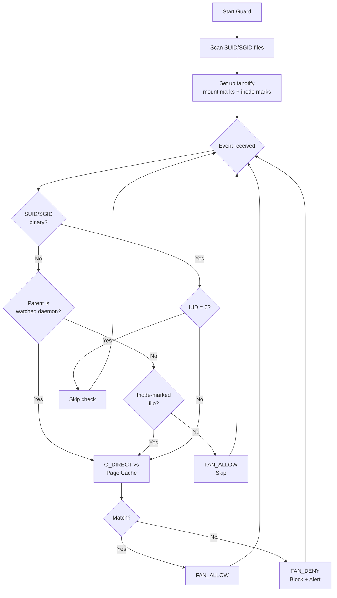

# pagecache-guard

**[中文文档](README.zh-CN.md)**

A runtime integrity guard that detects and blocks Linux page cache tampering attacks.

It uses `fanotify` + `O_DIRECT` to compare page cache content against on-disk content, covering multiple attack surfaces:

- **SUID/SGID binaries** — intercepts `execve()`, blocks tampered binaries
- **Daemon-executed files** — process-tree analysis detects files run by `crond`, `systemd`, `atd`
- **Critical config files** — inode-level monitoring of `/etc/passwd`, `/etc/profile`, PAM modules, `ld.so.preload`
- **Shared libraries** — periodic scanning for already-mapped libs

## Why This Exists

Page cache corruption vulnerabilities allow attackers to modify the in-memory content of **read-only** files:

| CVE | Name | Year | O_DIRECT Detectable |
|-----|------|------|:-------------------:|
| CVE-2026-43284 / CVE-2026-43500 | Dirty Frag | 2026 | ✅ |
| CVE-2026-31431 | Copy Fail | 2026 | ✅ |
| CVE-2022-0847 | Dirty Pipe | 2022 | ✅ |
| CVE-2016-5195 | Dirty COW | 2016 | ❌ |

Traditional security tools (file integrity monitors, image scanners, fs-verity) read through the page cache and **cannot detect** these attacks — they see the tampered data as "normal". `O_DIRECT` bypasses the page cache entirely, reading directly from disk, making it the only reliable way to detect page-cache-only tampering (Copy Fail, Dirty Pipe, Dirty Frag). Dirty COW is the exception — it writes corrupted data back to disk via page writeback, so `O_DIRECT` reads the same tampered content. Dirty COW requires traditional file integrity checks (AIDE / `rpm -V` / Tripwire) for detection.

## How It Works

```
┌──────────────────────────────────────────────────────────────┐
│                  pagecache_guard (v0.2)                       │
│                                                              │
│  FAN_OPEN_EXEC_PERM (mount mark) ──────────────────────────  │
│  On execve():                                                │
│    1. SUID/SGID binary?  → O_DIRECT check (block/allow)     │
│    2. Parent is crond/systemd/atd?  → O_DIRECT check         │
│    3. Neither?  → FAN_ALLOW (zero overhead)                  │
│                                                              │
│  FAN_OPEN_PERM (inode marks) ──────────────────────────────  │
│  On open() of marked files:                                  │
│    /etc/passwd, /etc/profile, PAM modules, ld.so.preload     │
│    → O_DIRECT check (block/allow)                            │
│                                                              │
│  Periodic O_DIRECT scan (background thread) ───────────────  │
│  Already-mapped shared libraries (libnss, libpam, etc.)      │
│  → Alert only (cannot block, already mmap'd)                 │
└──────────────────────────────────────────────────────────────┘
```



## Quick Start

```bash
# SUID-only mode (backward compatible, same as v0.1)
sudo python3 pagecache_guard.py /usr /bin /sbin

# Full protection — SUID + daemon-exec + critical files + periodic scan
sudo python3 -m pagecache_guard \
    --watch-daemon crond,anacron,atd,systemd \
    --watch-file /etc/passwd /etc/profile /etc/ld.so.preload \
    --watch-pam /lib64/security \
    --watch-lib /lib64/libnss_files.so.2 /lib64/libpam.so.0 \
    /usr /bin /sbin

# Add daemon-exec detection only (simplest extension)
sudo python3 -m pagecache_guard --watch-daemon crond,systemd /usr

# Dry-run mode (alert only, don't block)
sudo python3 -m pagecache_guard --dry-run /usr

# Periodic re-scan for new SUID files (every 5 minutes)
sudo python3 -m pagecache_guard --rescan-interval 300 /usr

# Log to syslog + file
sudo python3 -m pagecache_guard --syslog --log-file /var/log/pagecache_guard.log /usr

# Also check root executions
sudo python3 -m pagecache_guard --check-root /usr
```

## Example Output

```
2026-05-09 14:20:01 INFO Scanning for SUID/SGID files in: /usr
2026-05-09 14:20:03 INFO Found 21 SUID/SGID files
2026-05-09 14:20:03 INFO Watching daemon parents: anacron, atd, crond, systemd
2026-05-09 14:20:03 INFO Auto-discovered 12 PAM modules in /lib64/security
2026-05-09 14:20:03 INFO Inode marks set for 15 files
2026-05-09 14:20:03 INFO Periodic scanner started: 2 libs, interval=5s
2026-05-09 14:20:03 INFO Guard active [ENFORCE] features=[SUID, daemon-exec, inode-watch(15), periodic-scan(2)] check_root=False

# Tampered SUID binary blocked:
2026-05-09 14:20:38 WARNING [ALERT] BLOCKED pid=2677362 uid=1000 /usr/bin/su reason=suid
                            (page cache tampered at offset 0)

# Tampered cron script blocked:
2026-05-09 14:21:00 WARNING [ALERT] BLOCKED pid=2677500 uid=0 /usr/local/bin/backup.sh reason=daemon:crond
                            (page cache tampered at offset 128)

# Tampered PAM module blocked:
2026-05-09 14:21:05 WARNING [ALERT] BLOCKED pid=2677510 uid=0 /lib64/security/pam_unix.so reason=inode_watch
                            (page cache tampered at offset 4096)
```

On the user's side:

```bash
$ /usr/bin/su
bash: /usr/bin/su: Operation not permitted  (exit 126)
```

## Code Structure

```
pagecache-guard/
├── pagecache_guard/              # Python package (v0.2)
│   ├── __init__.py
│   ├── __main__.py               # CLI entry point (argparse + orchestration)
│   ├── config.py                 # Constants and libc handle
│   ├── core.py                   # O_DIRECT read, integrity check, checksum cache
│   ├── fanotify_handler.py       # fanotify setup, mount marks, event loop
│   ├── process_tree.py           # /proc traversal for daemon-child detection
│   ├── inode_watcher.py          # FAN_OPEN_PERM inode marks for critical files
│   └── periodic_scanner.py       # Background thread for mapped-lib scanning
├── pagecache_guard.py            # Backward-compatible single-file entry point
├── poc/                          # Exploitation PoCs
│   ├── host-attacks/             # 7 host-side attack path PoCs
│   ├── poc_marker.py
│   ├── verify_marker.py
│   └── shocker_copyfail.py
├── README.md
└── README.zh-CN.md
```

## Requirements

| Component | Recommended | Minimum | Notes |
|-----------|-------------|---------|-------|
| **Kernel** | >= 5.0 | >= 2.6.37 | 5.0+ for `FAN_OPEN_EXEC_PERM`; auto-fallback to `FAN_OPEN_PERM` on older kernels |
| **RHEL 8** | 4.18.0 | — | `FAN_OPEN_EXEC_PERM` backported (verified) |
| **Filesystem** | ext4 / XFS / Btrfs | — | Must support `O_DIRECT` |
| **Privileges** | root | `CAP_SYS_ADMIN` | Required for fanotify permission events |
| **Python** | 3.6+ | 3.6 | Uses f-strings and `os.splice` |

## Detection Scope

v0.2 extends coverage from SUID-only to **7 of 7** host-side attack paths (see `poc/host-attacks/` for PoCs):

| # | Attack Path | Mechanism | Timing | Can Block? |
|---|-------------|-----------|--------|:----------:|
| 1 | SUID/SGID binary overwrite | `FAN_OPEN_EXEC_PERM` + SUID check | At execve | ✅ |
| 2 | `/etc/passwd` UID tampering | `FAN_OPEN_PERM` inode mark | At open by NSS | ✅ |
| 3 | PAM module bypass | `FAN_OPEN_PERM` inode mark | At dlopen during auth | ✅ |
| 4 | Shared lib (new load) | `FAN_OPEN_PERM` inode mark | At open by dlopen | ✅ |
| 4' | Shared lib (already mapped) | Periodic O_DIRECT scan | Polled (5s default) | ❌ alert only |
| 5 | `/etc/profile` command injection | `FAN_OPEN_PERM` inode mark | At source by shell | ✅ |
| 6 | Cron/systemd exec'd file | `FAN_OPEN_EXEC_PERM` + parent=daemon | At execve | ✅ |
| 7 | `ld.so.preload` hijacking | `FAN_OPEN_PERM` inode mark | At open by ld.so | ✅ |
| — | Container escape (layer sharing) | Periodic O_DIRECT scan | Polled | ❌ alert only |

**6 of 7 paths** offer real-time blocking; only already-mapped shared libraries are alert-only (polled).

## PoC Scripts

| Script | Purpose |
|--------|---------|
| `poc/poc_marker.py` | Trigger Copy Fail to write `0xDEADBEEF` to a file's page cache |
| `poc/verify_marker.py` | Verify if the marker is visible (tests cross-container page cache sharing) |
| `poc/shocker_copyfail.py` | Shocker + Copy Fail combo — escape container via `CAP_DAC_READ_SEARCH` |
| `poc/host-attacks/` | **7 host-side exploitation PoCs**: passwd UID, PAM bypass, shared lib, profile inject, cron script, ld.so.preload, SUID ELF (see [README](poc/host-attacks/README.md)) |

**Warning**: PoC scripts require a vulnerable kernel and are for authorized research only.

## Technical Details

### Why O_DIRECT?

Page cache corruption attacks modify the kernel's in-memory file cache without going through the VFS write path. This means:

- **No dirty page flag** — `sync` won't flush the corruption to disk
- **File integrity monitors fail** — tools like AIDE/OSSEC read through the page cache, seeing tampered data as normal
- **Image scanners fail** — Trivy/Grype scan compressed layer blobs, not the page cache
- **`docker diff` fails** — only checks overlayfs upper layer changes
- **fs-verity fails** — only verifies on disk-to-cache read, not in-cache mutations

`O_DIRECT` is the only standard POSIX mechanism to bypass the page cache and read directly from the block device, making it uniquely suited for detecting these attacks.

### Why skip root?

Root already has full privileges — SUID escalation is irrelevant for root users. Skipping root reduces overhead and avoids noise from system services.

In container escape scenarios, the attacker corrupts the page cache (as container root), but the **victim** who executes the tampered SUID binary is a non-root user on the host — the guard correctly intercepts this.

### False positives during legitimate updates

If a SUID binary is being updated (e.g., `yum update`), the page cache and disk may temporarily differ. However, the Linux kernel prevents executing files with active write file descriptors (`ETXTBSY`), so legitimate updates cannot trigger false positive blocks.

## Related Research

- [Copy Fail — xint.io](https://xint.io/posts/copy-fail-cve-2026-31431/) — Original vulnerability disclosure and technical writeup
- [CVE-2026-31431 on NVD](https://nvd.nist.gov/vuln/detail/CVE-2026-31431)
- [Kernel fix commit](https://git.kernel.org/pub/scm/linux/kernel/git/torvalds/linux.git/commit/?id=a664bf3d603d)

## License

MIT
