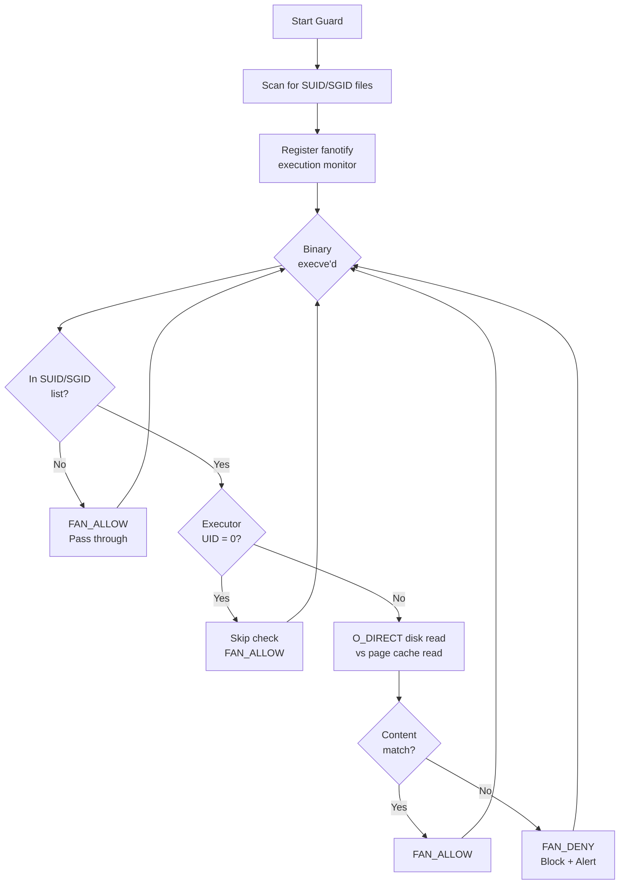

# pagecache-guard

**[中文文档](README.zh-CN.md)**

A runtime integrity guard that detects and blocks Linux page cache tampering attacks at execution time.

It intercepts `execve()` calls for SUID/SGID binaries using `fanotify`, then compares the file's page cache content against the on-disk content via `O_DIRECT`. If they differ, execution is denied — preventing privilege escalation through tampered SUID binaries.

## Why This Exists

Page cache corruption vulnerabilities allow attackers to modify the in-memory content of **read-only** files without touching the on-disk data:

| CVE | Name | Year |
|-----|------|------|
| CVE-2026-31431 | Copy Fail | 2026 |
| CVE-2022-0847 | Dirty Pipe | 2022 |
| CVE-2016-5195 | Dirty COW | 2016 |

Traditional security tools (file integrity monitors, image scanners, fs-verity) read through the page cache and **cannot detect** these attacks — they see the tampered data as "normal". `O_DIRECT` bypasses the page cache entirely, reading directly from disk, making it the only reliable way to detect such tampering.

## How It Works

```
┌─────────────────────────────────────────────────────────┐
│                    pagecache_guard                       │
│                                                         │
│  1. Scan directories for SUID/SGID binaries             │
│  2. Register fanotify FAN_OPEN_EXEC_PERM monitor        │
│  3. On execve() of a SUID/SGID binary:                  │
│     a. Check executor UID (skip root — already privd)   │
│     b. Read file via page cache (normal read)            │
│     c. Read file via O_DIRECT (bypass page cache)        │
│     d. Compare: match → ALLOW, mismatch → DENY          │
└─────────────────────────────────────────────────────────┘
```



## Quick Start

```bash
# Basic — monitor /usr, /bin, /sbin
sudo python3 pagecache_guard.py

# Specify paths
sudo python3 pagecache_guard.py /usr /bin /sbin

# Dry-run mode (alert only, don't block)
sudo python3 pagecache_guard.py --dry-run /usr

# Periodic re-scan for new SUID files (every 5 minutes)
sudo python3 pagecache_guard.py --rescan-interval 300 /usr

# Log to syslog
sudo python3 pagecache_guard.py --syslog /usr

# Log to file
sudo python3 pagecache_guard.py --log-file /var/log/pagecache_guard.log /usr

# Also check root executions
sudo python3 pagecache_guard.py --check-root /usr
```

## Example Output

```
2026-05-08 06:57:31 INFO Scanning for SUID/SGID files in: /usr
2026-05-08 06:57:34 INFO Found 21 SUID/SGID files
2026-05-08 06:57:34 INFO   SUID/SGID: /usr/bin/su
2026-05-08 06:57:34 INFO   SUID/SGID: /usr/bin/sudo
2026-05-08 06:57:34 INFO   SUID/SGID: /usr/bin/passwd
...
2026-05-08 06:57:34 INFO Monitoring mount (FAN_OPEN_EXEC_PERM): /usr
2026-05-08 06:57:34 INFO Guard active [ENFORCE] (event_size=24, check_root=False)

# Tampered /usr/bin/su detected and blocked:
2026-05-08 06:57:38 WARNING [ALERT] BLOCKED pid=2677362 uid=1000 /usr/bin/su
                            (page cache tampered at offset 0)
```

On the user's side:

```bash
$ /usr/bin/su
bash: /usr/bin/su: Operation not permitted  (exit 126)
```

## Requirements

| Component | Recommended | Minimum | Notes |
|-----------|-------------|---------|-------|
| **Kernel** | >= 5.0 | >= 2.6.37 | 5.0+ for `FAN_OPEN_EXEC_PERM`; auto-fallback to `FAN_OPEN_PERM` on older kernels |
| **RHEL 8** | 4.18.0 | — | `FAN_OPEN_EXEC_PERM` backported (verified) |
| **Filesystem** | ext4 / XFS / Btrfs | — | Must support `O_DIRECT` |
| **Privileges** | root | `CAP_SYS_ADMIN` | Required for fanotify permission events |
| **Python** | 3.6+ | 3.6 | Uses f-strings and `os.splice` |

## Detection Scope

| Scenario | Covered | Notes |
|----------|:-------:|-------|
| **Host SUID privilege escalation** | ✅ | Core use case — blocks tampered SUID binaries |
| **Container escape** | ❌ | Escapes target cron/systemd/shell configs, not SUID files |
| **Cross-container attack** | ❌ | Polluted files are not necessarily SUID |

For broader coverage (container escape, cross-container attacks), combine with periodic `O_DIRECT` full-scan of critical system files.

## PoC Scripts

| Script | Purpose |
|--------|---------|
| `poc/poc_marker.py` | Trigger Copy Fail to write `0xDEADBEEF` to a file's page cache |
| `poc/verify_marker.py` | Verify if the marker is visible (tests cross-container page cache sharing) |
| `poc/shocker_copyfail.py` | Shocker + Copy Fail combo — escape container via `CAP_DAC_READ_SEARCH` |

**Warning**: PoC scripts require a vulnerable kernel and are for authorized research only.

## Technical Details

### Why O_DIRECT?

Page cache corruption attacks modify the kernel's in-memory file cache without going through the VFS write path. This means:

- **No dirty page flag** — `sync` won't flush the corruption to disk
- **File integrity monitors fail** — tools like AIDE/OSSEC read through the page cache, seeing tampered data as normal
- **Image scanners fail** — Trivy/Grype scan compressed layer blobs, not the page cache
- **`docker diff` fails** — only checks overlayfs upper layer changes
- **fs-verity fails** — only verifies on disk-to-cache read, not in-cache mutations

`O_DIRECT` is the only standard POSIX mechanism to bypass the page cache and read directly from the block device, making it uniquely suited for detecting these attacks.

### Why skip root?

Root already has full privileges — SUID escalation is irrelevant for root users. Skipping root reduces overhead and avoids noise from system services.

In container escape scenarios, the attacker corrupts the page cache (as container root), but the **victim** who executes the tampered SUID binary is a non-root user on the host — the guard correctly intercepts this.

### False positives during legitimate updates

If a SUID binary is being updated (e.g., `yum update`), the page cache and disk may temporarily differ. However, the Linux kernel prevents executing files with active write file descriptors (`ETXTBSY`), so legitimate updates cannot trigger false positive blocks.

## Related Research

- [CVE-2026-31431 on NVD](https://nvd.nist.gov/vuln/detail/CVE-2026-31431)
- [Kernel fix commit](https://git.kernel.org/pub/scm/linux/kernel/git/torvalds/linux.git/commit/?id=a664bf3d603d)

## License

MIT
