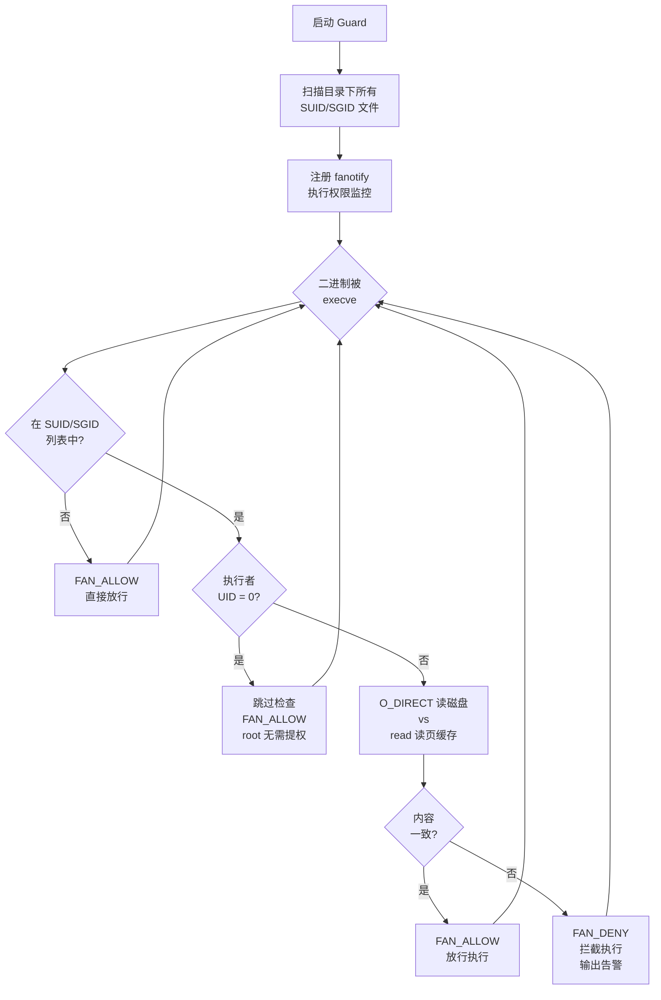

# pagecache-guard

**[English](README.md)**

一个运行时完整性守护工具，在执行时检测并拦截 Linux 页缓存篡改攻击。

通过 `fanotify` 拦截 SUID/SGID 二进制文件的 `execve()` 调用，使用 `O_DIRECT` 比对页缓存内容与磁盘内容。若不一致则拒绝执行，阻止通过篡改 SUID 文件实现的提权攻击。

## 背景

页缓存覆写类漏洞允许攻击者在不修改磁盘数据的情况下，篡改**只读**文件的内存缓存内容：

| CVE | 名称 | 年份 |
|-----|------|------|
| CVE-2026-31431 | Copy Fail | 2026 |
| CVE-2022-0847 | Dirty Pipe | 2022 |
| CVE-2016-5195 | Dirty COW | 2016 |

传统安全工具（文件完整性监控、镜像扫描、fs-verity）通过页缓存读取文件，**无法检测**此类攻击 —— 读到的就是被篡改后的数据。`O_DIRECT` 绕过页缓存直接从磁盘读取，是检测此类攻击的唯一可靠方式。

## 工作原理



## 快速开始

```bash
# 基本用法 — 监控 /usr /bin /sbin 下的 SUID/SGID 文件
sudo python3 pagecache_guard.py

# 指定监控路径
sudo python3 pagecache_guard.py /usr /bin /sbin

# Dry-run 模式（只告警不拦截）
sudo python3 pagecache_guard.py --dry-run /usr

# 定期重新扫描 SUID 文件（每 300 秒）
sudo python3 pagecache_guard.py --rescan-interval 300 /usr

# 输出到 syslog
sudo python3 pagecache_guard.py --syslog /usr

# 输出到日志文件
sudo python3 pagecache_guard.py --log-file /var/log/pagecache_guard.log /usr

# 连 root 执行也检查
sudo python3 pagecache_guard.py --check-root /usr
```

## 运行效果

```
2026-05-08 06:57:31 INFO Scanning for SUID/SGID files in: /usr
2026-05-08 06:57:34 INFO Found 21 SUID/SGID files
2026-05-08 06:57:34 INFO   SUID/SGID: /usr/bin/su
2026-05-08 06:57:34 INFO   SUID/SGID: /usr/bin/sudo
...
2026-05-08 06:57:34 INFO Guard active [ENFORCE] (event_size=24, check_root=False)

# 被篡改的 /usr/bin/su 被检测并拦截:
2026-05-08 06:57:38 WARNING [ALERT] BLOCKED pid=2677362 uid=1000 /usr/bin/su
                            (page cache tampered at offset 0)
```

用户侧：

```bash
$ /usr/bin/su
bash: /usr/bin/su: 不允许的操作  (exit 126)
```

## 系统要求

| 组件 | 推荐 | 最低要求 | 说明 |
|------|------|----------|------|
| **内核** | >= 5.0 | >= 2.6.37 | 5.0+ 支持 `FAN_OPEN_EXEC_PERM`；旧内核自动降级到 `FAN_OPEN_PERM` |
| **RHEL 8** | 4.18.0 | — | `FAN_OPEN_EXEC_PERM` 已通过 RHEL backport 支持（已验证） |
| **文件系统** | ext4 / XFS / Btrfs | — | 须支持 `O_DIRECT` |
| **权限** | root | `CAP_SYS_ADMIN` | fanotify 权限事件需要 |
| **Python** | 3.6+ | 3.6 | 使用 f-string 和 `os.splice` |

## 检测覆盖范围

| 场景 | 覆盖 | 说明 |
|------|:----:|------|
| **宿主机 SUID 提权** | ✅ | 核心用途 — 拦截被篡改的 SUID 二进制 |
| **容器逃逸** | ❌ | 逃逸目标是 cron/systemd/shell 配置等非 SUID 文件 |
| **跨容器攻击** | ❌ | 被污染的文件不一定是 SUID |

如需更广的覆盖范围（容器逃逸、跨容器攻击），可结合定期 `O_DIRECT` 全量扫描关键系统文件。

## PoC 脚本

| 脚本 | 用途 |
|------|------|
| `poc/poc_marker.py` | 触发 Copy Fail 向文件页缓存写入 `0xDEADBEEF` 标记 |
| `poc/verify_marker.py` | 验证标记是否可见（测试跨容器页缓存共享） |
| `poc/shocker_copyfail.py` | Shocker + Copy Fail 组合攻击 — 通过 `CAP_DAC_READ_SEARCH` 实现容器逃逸 |

**警告**: PoC 脚本需要未修补的内核，仅用于授权安全研究。

## 技术细节

### 为什么用 O_DIRECT？

页缓存覆写攻击直接修改内核内存中的文件缓存，不经过 VFS 写路径。这意味着：

- **不设置脏页标记** — `sync` 不会将篡改刷回磁盘
- **文件完整性监控失效** — AIDE/OSSEC 等通过页缓存读取，看到的是篡改后的数据
- **镜像扫描失效** — Trivy/Grype 扫描的是压缩层 blob，与页缓存无关
- **`docker diff` 失效** — 只检查 overlayfs upper layer 变更
- **fs-verity 失效** — 仅在磁盘→缓存读取时验证，不检测缓存内篡改

`O_DIRECT` 是唯一的标准 POSIX 方式来绕过页缓存直接读磁盘，因此是检测此类攻击的唯一可靠手段。

### 为什么跳过 root？

root 已有最高权限，SUID 提权对 root 无意义。跳过 root 减少开销并避免系统服务产生噪声。

在容器逃逸场景中，攻击者（容器内 root）篡改 page cache，但**受害者**是宿主机上的普通用户执行被篡改的 SUID 文件 — Guard 正确拦截此场景。

### 合法更新期间的误报

当 SUID 文件正在被包管理器更新时，页缓存与磁盘可能暂时不一致。但 Linux 内核通过 `deny_write_access()` 阻止执行存在活跃写入 FD 的文件（`ETXTBSY`），因此合法更新不会触发误报拦截。

## 相关研究

- [CVE-2026-31431 on NVD](https://nvd.nist.gov/vuln/detail/CVE-2026-31431)
- [内核修复 commit](https://git.kernel.org/pub/scm/linux/kernel/git/torvalds/linux.git/commit/?id=a664bf3d603d)

## License

MIT
