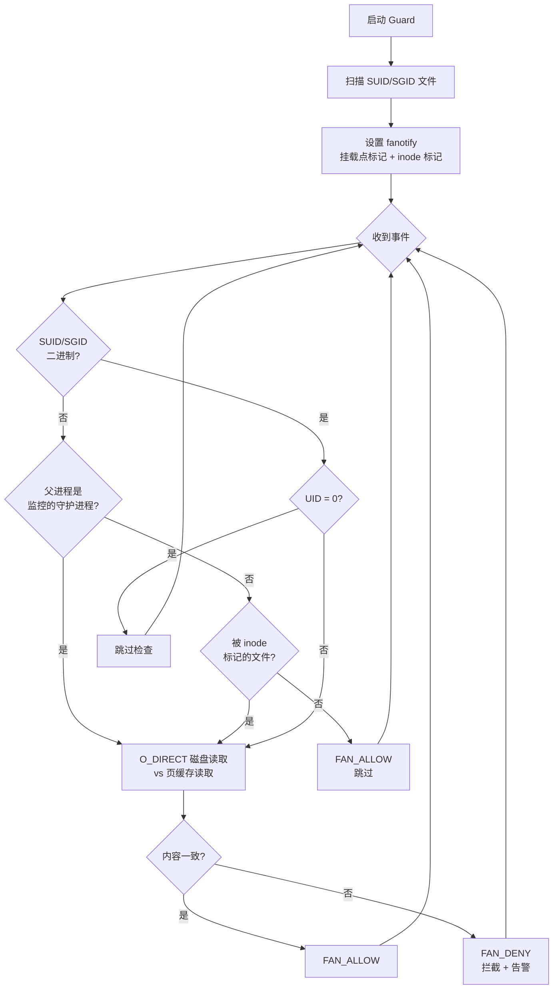

# pagecache-guard

**[English](README.md)**

一个运行时完整性守护工具，检测并拦截 Linux 页缓存篡改攻击。

通过 `fanotify` + `O_DIRECT` 比对页缓存内容与磁盘内容，覆盖多种攻击面：

- **SUID/SGID 二进制** — 拦截 `execve()`，阻断被篡改的二进制执行
- **守护进程执行的文件** — 进程树分析，检测 `crond`、`systemd`、`atd` 执行的文件
- **关键配置文件** — inode 级监控 `/etc/passwd`、`/etc/profile`、PAM 模块、`ld.so.preload`
- **共享库** — 周期性扫描已映射的共享库

## 背景

页缓存覆写类漏洞允许攻击者篡改**只读**文件的内存缓存内容：

| CVE | 名称 | 年份 | O_DIRECT 可检测 |
|-----|------|------|:---------------:|
| CVE-2026-43284 / CVE-2026-43500 | Dirty Frag | 2026 | ✅ |
| CVE-2026-31431 | Copy Fail | 2026 | ✅ |
| CVE-2022-0847 | Dirty Pipe | 2022 | ✅ |
| CVE-2016-5195 | Dirty COW | 2016 | ❌ |

传统安全工具（文件完整性监控、镜像扫描、fs-verity）通过页缓存读取文件，**无法检测**此类攻击。`O_DIRECT` 绕过页缓存直接从磁盘读取，是检测仅修改页缓存的漏洞（Copy Fail、Dirty Pipe、Dirty Frag）的唯一可靠方式。Dirty COW 例外——它会通过 page writeback 将篡改数据写回磁盘，`O_DIRECT` 读到的也是篡改后的内容，需要依赖传统文件完整性工具（AIDE / `rpm -V` / Tripwire）检测。

## 工作原理

```
┌──────────────────────────────────────────────────────────────┐
│                  pagecache_guard (v0.2)                       │
│                                                              │
│  FAN_OPEN_EXEC_PERM（挂载点标记）────────────────────────── │
│  execve 事件:                                                │
│    1. SUID/SGID 二进制?  → O_DIRECT 检查（拦截/放行）       │
│    2. 父进程是 crond/systemd/atd?  → O_DIRECT 检查          │
│    3. 都不是?  → FAN_ALLOW（零开销）                        │
│                                                              │
│  FAN_OPEN_PERM（inode 标记）─────────────────────────────── │
│  标记文件被 open() 时:                                       │
│    /etc/passwd, /etc/profile, PAM 模块, ld.so.preload        │
│    → O_DIRECT 检查（拦截/放行）                              │
│                                                              │
│  周期性 O_DIRECT 扫描（后台线程）────────────────────────── │
│  已映射的共享库（libnss、libpam 等）                         │
│  → 仅告警（无法拦截，已被 mmap）                            │
└──────────────────────────────────────────────────────────────┘
```



## 快速开始

```bash
# 仅 SUID 模式（向后兼容 v0.1）
sudo python3 pagecache_guard.py /usr /bin /sbin

# 全功能模式 — SUID + 守护进程执行 + 关键文件 + 周期扫描
sudo python3 -m pagecache_guard \
    --watch-daemon crond,anacron,atd,systemd \
    --watch-file /etc/passwd /etc/profile /etc/ld.so.preload \
    --watch-pam /lib64/security \
    --watch-lib /lib64/libnss_files.so.2 /lib64/libpam.so.0 \
    /usr /bin /sbin

# 仅添加守护进程执行检测（最简扩展）
sudo python3 -m pagecache_guard --watch-daemon crond,systemd /usr

# Dry-run 模式（只告警不拦截）
sudo python3 -m pagecache_guard --dry-run /usr

# 定期重新扫描 SUID 文件（每 300 秒）
sudo python3 -m pagecache_guard --rescan-interval 300 /usr

# 输出到 syslog + 日志文件
sudo python3 -m pagecache_guard --syslog --log-file /var/log/pagecache_guard.log /usr

# 连 root 执行也检查
sudo python3 -m pagecache_guard --check-root /usr
```

## 运行效果

```
2026-05-09 14:20:01 INFO Scanning for SUID/SGID files in: /usr
2026-05-09 14:20:03 INFO Found 21 SUID/SGID files
2026-05-09 14:20:03 INFO Watching daemon parents: anacron, atd, crond, systemd
2026-05-09 14:20:03 INFO Auto-discovered 12 PAM modules in /lib64/security
2026-05-09 14:20:03 INFO Inode marks set for 15 files
2026-05-09 14:20:03 INFO Periodic scanner started: 2 libs, interval=5s
2026-05-09 14:20:03 INFO Guard active [ENFORCE] features=[SUID, daemon-exec, inode-watch(15), periodic-scan(2)] check_root=False

# 被篡改的 SUID 二进制被拦截:
2026-05-09 14:20:38 WARNING [ALERT] BLOCKED pid=2677362 uid=1000 /usr/bin/su reason=suid
                            (page cache tampered at offset 0)

# 被篡改的 cron 脚本被拦截:
2026-05-09 14:21:00 WARNING [ALERT] BLOCKED pid=2677500 uid=0 /usr/local/bin/backup.sh reason=daemon:crond
                            (page cache tampered at offset 128)

# 被篡改的 PAM 模块被拦截:
2026-05-09 14:21:05 WARNING [ALERT] BLOCKED pid=2677510 uid=0 /lib64/security/pam_unix.so reason=inode_watch
                            (page cache tampered at offset 4096)
```

用户侧：

```bash
$ /usr/bin/su
bash: /usr/bin/su: 不允许的操作  (exit 126)
```

## 代码结构

```
pagecache-guard/
├── pagecache_guard/              # Python 包（v0.2）
│   ├── __init__.py
│   ├── __main__.py               # CLI 入口（argparse + 流程编排）
│   ├── config.py                 # 常量和 libc 句柄
│   ├── core.py                   # O_DIRECT 读取、完整性校验、校验和缓存
│   ├── fanotify_handler.py       # fanotify 设置、挂载点标记、事件循环
│   ├── process_tree.py           # /proc 进程树遍历（守护进程子进程检测）
│   ├── inode_watcher.py          # FAN_OPEN_PERM inode 标记管理
│   └── periodic_scanner.py       # 后台线程周期扫描已映射共享库
├── pagecache_guard.py            # 向后兼容的单文件入口
├── poc/                          # 漏洞利用 PoC
│   ├── host-attacks/             # 7 条宿主机攻击路径 PoC
│   ├── poc_marker.py
│   ├── verify_marker.py
│   └── shocker_copyfail.py
├── README.md
└── README.zh-CN.md
```

## 系统要求

| 组件 | 推荐 | 最低要求 | 说明 |
|------|------|----------|------|
| **内核** | >= 5.0 | >= 2.6.37 | 5.0+ 支持 `FAN_OPEN_EXEC_PERM`；旧内核自动降级到 `FAN_OPEN_PERM` |
| **RHEL 8** | 4.18.0 | — | `FAN_OPEN_EXEC_PERM` 已通过 RHEL backport 支持（已验证） |
| **文件系统** | ext4 / XFS / Btrfs | — | 须支持 `O_DIRECT` |
| **权限** | root | `CAP_SYS_ADMIN` | fanotify 权限事件需要 |
| **Python** | 3.6+ | 3.6 | 使用 f-string 和 `os.splice` |

## 检测覆盖范围

v0.2 将覆盖范围从仅 SUID 扩展至 **7/7** 条宿主机攻击路径（PoC 见 `poc/host-attacks/`）：

| # | 攻击路径 | 检测机制 | 时机 | 可拦截? |
|---|---------|---------|------|:------:|
| 1 | SUID/SGID 二进制覆写 | `FAN_OPEN_EXEC_PERM` + SUID 检查 | execve 时 | ✅ |
| 2 | `/etc/passwd` UID 篡改 | `FAN_OPEN_PERM` inode 标记 | NSS open 时 | ✅ |
| 3 | PAM 模块认证绕过 | `FAN_OPEN_PERM` inode 标记 | 认证时 dlopen | ✅ |
| 4 | 共享库（新加载） | `FAN_OPEN_PERM` inode 标记 | dlopen open 时 | ✅ |
| 4' | 共享库（已映射） | 周期性 O_DIRECT 扫描 | 轮询（默认 5s） | ❌ 仅告警 |
| 5 | `/etc/profile` 命令注入 | `FAN_OPEN_PERM` inode 标记 | Shell source 时 | ✅ |
| 6 | Cron/systemd 执行的文件 | `FAN_OPEN_EXEC_PERM` + 父进程=守护进程 | execve 时 | ✅ |
| 7 | `ld.so.preload` 路径劫持 | `FAN_OPEN_PERM` inode 标记 | ld.so open 时 | ✅ |
| — | 容器逃逸（层共享） | 周期性 O_DIRECT 扫描 | 轮询 | ❌ 仅告警 |

**7 条路径中 6 条支持实时拦截**；仅已映射的共享库为告警模式（轮询）。

## PoC 脚本

| 脚本 | 用途 |
|------|------|
| `poc/poc_marker.py` | 触发 Copy Fail 向文件页缓存写入 `0xDEADBEEF` 标记 |
| `poc/verify_marker.py` | 验证标记是否可见（测试跨容器页缓存共享） |
| `poc/shocker_copyfail.py` | Shocker + Copy Fail 组合攻击 — 通过 `CAP_DAC_READ_SEARCH` 实现容器逃逸 |
| `poc/host-attacks/` | **7 条宿主机攻击路径 PoC**：passwd UID / PAM 绕过 / 共享库 / profile 注入 / cron 脚本 / ld.so.preload / SUID ELF（详见 [README](poc/host-attacks/README.md)） |

**警告**: PoC 脚本需要未修补的内核，仅用于授权安全研究。

## 技术细节

### 为什么用 O_DIRECT？

页缓存覆写攻击直接修改内核内存中的文件缓存，不经过 VFS 写路径。这意味着：

- **不设置脏页标记** — `sync` 不会将篡改刷回磁盘
- **文件完整性监控失效** — AIDE/OSSEC 等通过页缓存读取，看到的是篡改后的数据
- **镜像扫描失效** — Trivy/Grype 扫描的是压缩层 blob，与页缓存无关
- **`docker diff` 失效** — 只检查 overlayfs upper layer 变更
- **fs-verity 失效** — 仅在磁盘→缓存读取时验证，不检测缓存内篡改

`O_DIRECT` 是唯一的标准 POSIX 方式来绕过页缓存直接读磁盘，因此是检测此类攻击的唯一可靠手段。

### 为什么跳过 root？

root 已有最高权限，SUID 提权对 root 无意义。跳过 root 减少开销并避免系统服务产生噪声。

在容器逃逸场景中，攻击者（容器内 root）篡改 page cache，但**受害者**是宿主机上的普通用户执行被篡改的 SUID 文件 — Guard 正确拦截此场景。

### 合法更新期间的误报

当 SUID 文件正在被包管理器更新时，页缓存与磁盘可能暂时不一致。但 Linux 内核通过 `deny_write_access()` 阻止执行存在活跃写入 FD 的文件（`ETXTBSY`），因此合法更新不会触发误报拦截。

## 相关研究

- [Copy Fail — xint.io](https://xint.io/posts/copy-fail-cve-2026-31431/) — 漏洞原始披露与技术分析
- [Copy Fail — reinject.top](https://reinject.top/posts/linux-security/copy-fail-cve-2026-31431/) — 深度研究文章
- [CVE-2026-31431 on NVD](https://nvd.nist.gov/vuln/detail/CVE-2026-31431)
- [内核修复 commit](https://git.kernel.org/pub/scm/linux/kernel/git/torvalds/linux.git/commit/?id=a664bf3d603d)

## License

MIT
